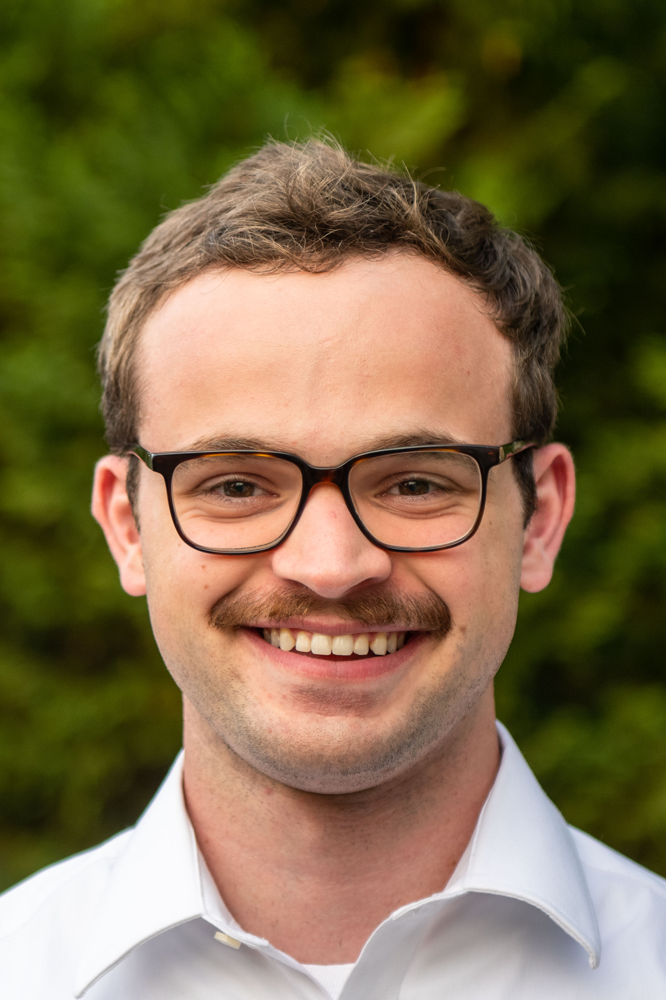

.. title: About Me
.. slug: index
.. date: 2024-11-06 14:06:56 UTC-05:00
.. tags: 
.. category: 
.. link: 
.. description: 
.. type: text

I'm a PhD student at Cornell University, where I study practical parallel algorithms. My focus is on graph-based datastructures for large-scale vector search. I'm currently working with `Alex Conway <https://ajhconway.com/>`_, `Ken Birman <https://www.cs.cornell.edu/ken/>`_, and `Giulia Guidi <https://giuliaguidi.github.io/>`_.

I completed a dual BS in Mathematics and Computer Science and a MS in Computer Science at the University of Maryland, where I was advised by the incomparable `Laxman Dhulipala <https://www.cs.umd.edu/~laxman/>`_. Earlier in my undergraduate career, I was fortunate to work with `Lisa Singh <https://people.cs.georgetown.edu/~singh/>`_ on natural language processing, then `Bill Regli <https://isr.umd.edu/clark/faculty/902/William-Regli>`_ on graph accelerators, then `Marine Carpuat <https://www.cs.umd.edu/~marine/>`_ on natural language processing again.

The summer of 2024, I was fortunate to intern at Microsoft Research India, where I worked with `Ravishankar Krishnaswamy <https://rakri.github.io/>`_, `Kiran Shiragur <https://sites.google.com/view/kiran-shiragur>`_ and others on `DiskANN <https://www.microsoft.com/en-us/research/project/project-akupara-approximate-nearest-neighbor-search-for-large-scale-semantic-search/>`_.

:sc:`{}`
